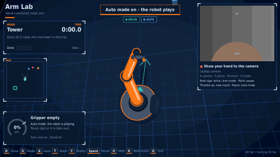
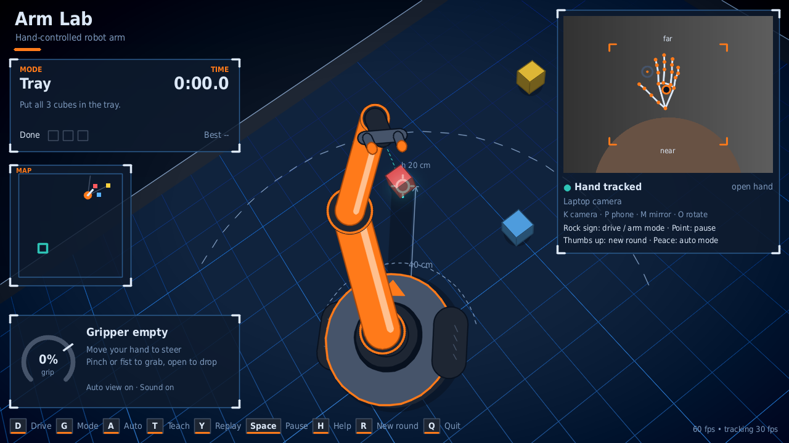
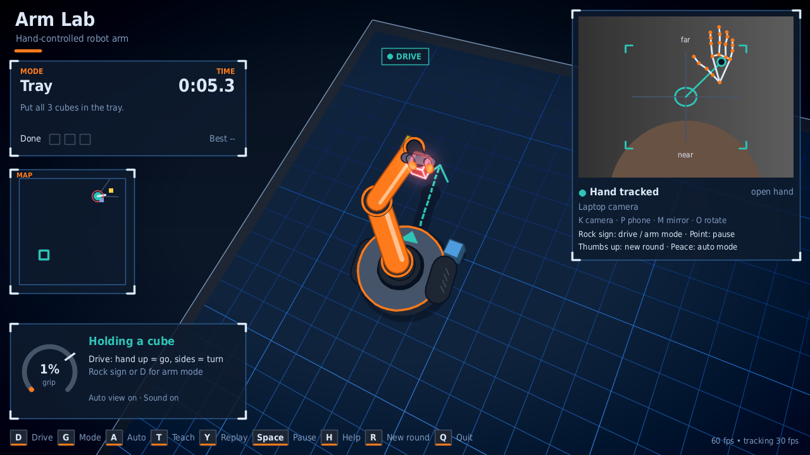
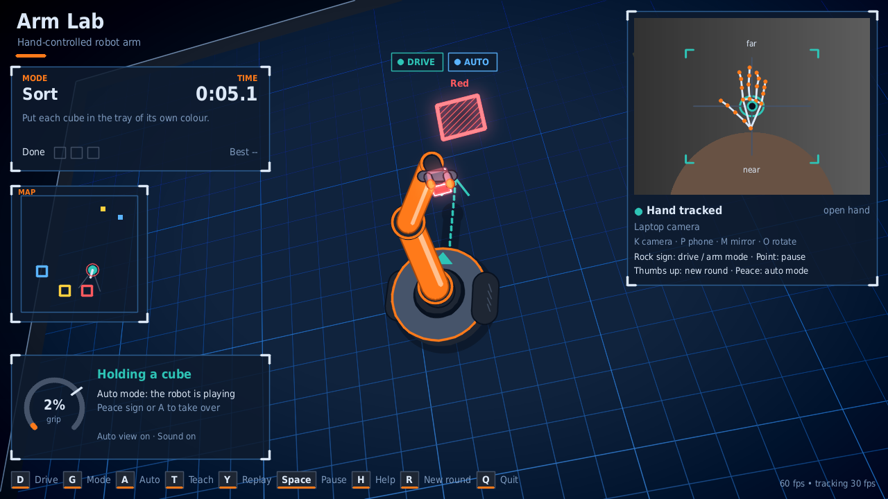
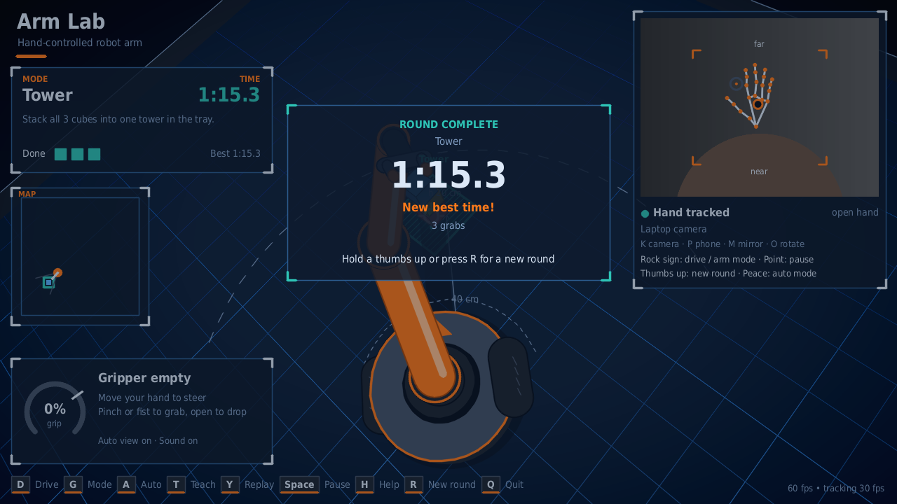
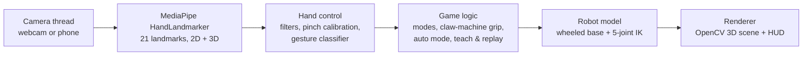

# Arm Lab: Hand-Controlled Mobile Robot Arm

Control a simulated robot arm on wheels with **one bare hand and a webcam**. No gloves, no controller, no robot hardware: the camera tracks your hand, and gestures drive the base, steer the arm and pick up cubes.



*Auto mode building a tower, shown at 2x speed. In normal play every move comes from your hand.*

---

## Features

- **One-hand control.** Move your hand to steer the gripper; pinch (or make a fist) to grab; open your hand to drop. The arm handles the up-and-down by itself, like a claw machine.
- **Drive mode.** A rock sign switches your hand into a joystick for the wheeled base: up = forward, sideways = turn, middle = stop.
- **Four held gestures.** Rock sign = drive / arm mode, thumbs up = new round, peace sign = auto mode, point = pause.
- **5-joint arm with inverse kinematics.** Base yaw, shoulder, elbow, wrist pitch and roll, eased like real servo motors.
- **Custom 3D renderer.** Perspective camera, shading, shadows, glow and a HUD, all drawn with OpenCV. No game engine.
- **Auto mode with path planning.** The robot plans a clear route, parks next to each cube, picks it and delivers it.
- **Teach & replay.** Record a run by hand, then the robot repeats it exactly, the way factory robots are taught by demonstration.
- **Four game modes.** Tray, Tower, Sort by colour and Free play, with a clock, best times, a results card and a 7-step tutorial.
- **Any camera.** Laptop webcam, USB camera, or your phone over Wi-Fi (IP Webcam / DroidCam).

| Arm mode | Drive mode |
| --- | --- |
|  |  |

| Sort mode (auto) | Round complete |
| --- | --- |
|  |  |

---

## How it works



**Hand tracking.** MediaPipe's hand landmarker runs on its own thread and returns 21 points per hand, both in the picture and in 3D. A median filter removes one-frame spikes, a [One Euro filter](https://gery.casiez.net/1euro/) smooths a still hand without slowing a fast one, and a small dead-band stops drift.

**Grabbing.** The pinch is measured against *your own* hand: the program keeps learning your relaxed gap and your tightest pinch, so small hands and loose pinches work. A real pinch must also aim the thumb at the index tip, which stops a thumb sweeping across the palm from counting as a grab.

**Gestures.** Each finger's straightness is the fingertip-to-wrist distance divided by the knuckle-to-wrist distance, taken from the 3D hand so it works at any angle (about 1.9 straight, 0.9 curled). A gesture must be held still for 0.8 s and fires once.

**The robot.** The arm's inverse kinematics is solved in closed form in the base's own frame; cubes, trays and targets live in the world frame. The base is a differential drive with acceleration limits and simple collision checks against walls and cubes.

**Rendering.** A perspective camera follows behind the robot and rolls so that "hand up" always means "up on screen". The floor patch in view is clipped (Sutherland-Hodgman for the floor, Cyrus-Beck for grid lines) so nothing behind the camera is ever projected. Cached backgrounds and pre-rendered text keep a frame at about 12 ms.

---

## Controls

| Your hand | Action |
| --- | --- |
| Move (arm mode) | Steer the gripper: sideways = swing, up / down = far / near |
| Pinch, or fist with thumb tucked | Grab: the arm goes down, grabs and lifts |
| Open hand | Drop: the arm goes down, places and lifts |
| Move (drive mode) | Joystick: up = forward, down = back, sideways = turn, middle = stop |

| Gesture (hold about 1 s) | Action |
| --- | --- |
| Rock sign (index + little finger) | Drive mode / arm mode (works while holding a cube) |
| Thumbs up | New round |
| Peace sign | Auto mode on / off |
| Point (index finger) | Pause / resume |

| Key | Action | Key | Action |
| --- | --- | --- | --- |
| D | Drive / arm mode | R | New round |
| G | Next game mode | U | Tutorial |
| A | Auto mode | H | Help screen |
| T | Teach (record) | N | Sound on / off |
| Y | Replay | V | Auto camera on / off |
| Space | Pause | K / P | Switch camera / phone camera |
| M / O | Mirror / rotate picture | Q | Quit |

---

## Getting started

**Requirements:** Python 3.14 and a webcam (or a phone used as a camera). Made for Windows; on macOS and Linux it runs without the sound effects.

1. Download this repo: green **Code** button → **Download ZIP**, then unzip it (or `git clone` it).
2. Open a terminal in the folder and run:

```bash
py -3.14 -m pip install -r requirements.txt     # macOS / Linux: python3 -m pip install -r requirements.txt
py -3.14 hand_arm.py                            # macOS / Linux: python3 hand_arm.py
```

The first start downloads the MediaPipe hand model (about 8 MB) and runs a short tutorial.

**Phone as the camera** (same Wi-Fi): install *IP Webcam* (Android) or *DroidCam*, start its server, press **P** in Arm Lab and type the address the app shows, for example `192.168.1.5:8080`. Or start with:

```bash
py -3.14 hand_arm.py --phone 192.168.1.5:8080
```

Settings (camera, mirror, mode, sound) are saved to `camera_settings.json`, best times to `arm_lab_stats.json`.

---

## Testing

There is no webcam in a test environment, so the program was tested in simulation with **synthetic 3D hands** (realistic finger joints, noise, dropped frames and glitches) driving the real game code.

| Test | Result |
| --- | --- |
| Gesture transitions (4 gestures, 2 start poses, 3 speeds, 3 orders, 4 noise seeds) | 288 / 288: exactly one action, zero accidental grabs |
| Switching from a pinch or fist straight into drive mode | 72 / 72 kept the cube |
| Auto mode on random layouts, all 4 modes | 120 / 120 rounds finished, never hit a cube or wall |
| Scripted player using only gestures and the hand joystick | 20 / 20 rounds finished |
| Replay of a taught round at a jittery 25 to 90 fps | Cubes end within 0.2 mm of the taught run |
| Random keys, poses and frame times | 56,000 frames, 0 crashes |
| Frame time while driving | about 12 ms |

---

## Project structure

All the code is in one file, `hand_arm.py` (the images in this folder are only for this page). It is split into eight sections:

| # | Section | What it does |
| --- | --- | --- |
| 1 | Settings | Every tunable number in one place |
| 2 | Robot linkage | Forward and inverse kinematics of the 5-joint arm |
| 3 | Smoothing filter | One Euro filter |
| 4 | One-hand control | Steering, pinch calibration, gesture classifier, drive stick |
| 5 | Camera + hand tracking | Camera and MediaPipe threads, phone streams, camera overlay |
| 6 | World + game rules | Arena, cubes, trays, wheeled base, claw-machine grip, auto mode, teach & replay, tutorial |
| 7 | Look & feel | 3D view, floor clipping, drawing, HUD, map, help screen |
| 8 | Main loop | The `Game` class (testable without a camera) and the window |

## Tech stack

Python 3.14 · [MediaPipe](https://ai.google.dev/edge/mediapipe/solutions/vision/hand_landmarker) (hand landmarks) · [OpenCV](https://opencv.org/) (camera, drawing, window) · [NumPy](https://numpy.org/) (math) · [Pillow](https://python-pillow.org/) (smooth TrueType text)

## Roadmap

- **Real hardware:** send the 5 joint angles and 2 wheel speeds to an Arduino on a robot car with an arm kit.
- **Real physics:** move the scene to MuJoCo for friction, pushing and tipping cubes.
- **Saved programs:** several taught routines stored as files.
- **Voice commands** alongside gestures.

## Acknowledgements

Hand tracking uses Google's MediaPipe Hand Landmarker model, downloaded on first run.
